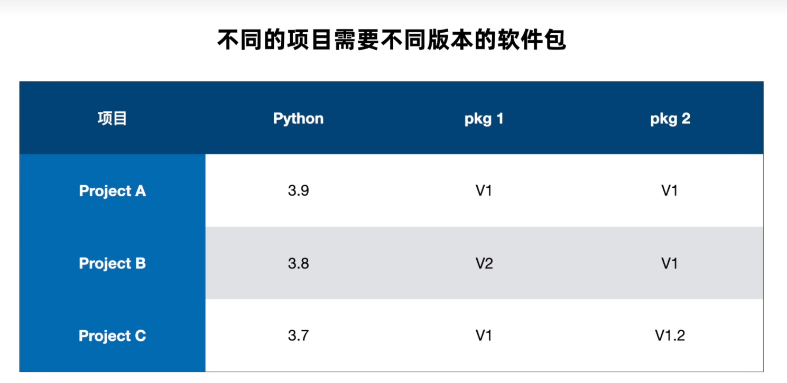
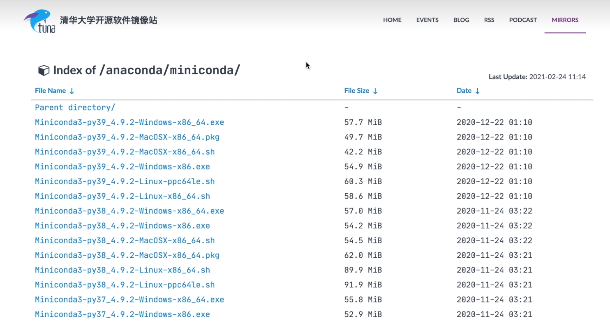
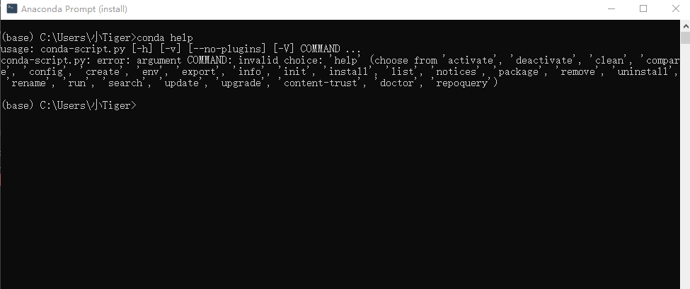
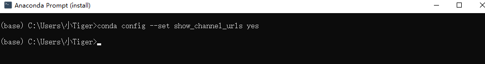
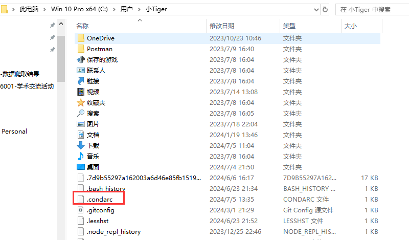
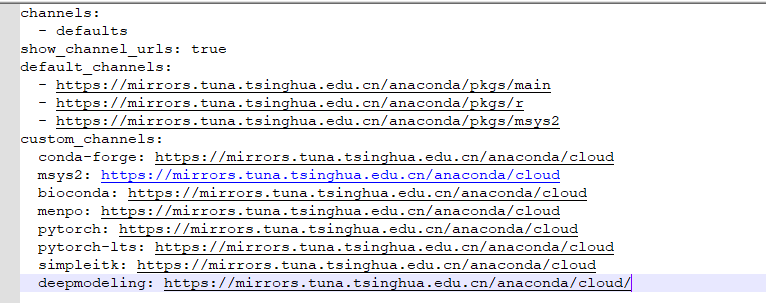

# Conda

> 官网：https://docs.conda.io/en/latest/

## 一、概念

类似nvm，用于管理不同的node版本。Conda用于管理不同的python版本，方便项目之间切换。



:bulb: 主要分为anaconda 和 miniconda，类似QQ 和 TIM，根据需要安装


## 二、安装

根据个人情况，是否使用镜像安装 https://mirrors.tuna.tsinghua.edu.cn/anaconda/miniconda/?C=M&O=D



:warning: 安装Conda前，如本机python环境仍存在，将环境变量中的py路径去掉即可

安装完成 ，打开 anaconda prompt 




## 三、更改镜像源

1.生成本地.condarc





2.修改.condarc文件内容



```
channels:
  - defaults
show_channel_urls: true
default_channels:
  - https://mirrors.tuna.tsinghua.edu.cn/anaconda/pkgs/main
  - https://mirrors.tuna.tsinghua.edu.cn/anaconda/pkgs/r
  - https://mirrors.tuna.tsinghua.edu.cn/anaconda/pkgs/msys2
custom_channels:
  conda-forge: https://mirrors.tuna.tsinghua.edu.cn/anaconda/cloud
  msys2: https://mirrors.tuna.tsinghua.edu.cn/anaconda/cloud
  bioconda: https://mirrors.tuna.tsinghua.edu.cn/anaconda/cloud
  menpo: https://mirrors.tuna.tsinghua.edu.cn/anaconda/cloud
  pytorch: https://mirrors.tuna.tsinghua.edu.cn/anaconda/cloud
  pytorch-lts: https://mirrors.tuna.tsinghua.edu.cn/anaconda/cloud
  simpleitk: https://mirrors.tuna.tsinghua.edu.cn/anaconda/cloud
  deepmodeling: https://mirrors.tuna.tsinghua.edu.cn/anaconda/cloud/
```

3.清楚缓存

```
conda clean -i
```

## 四、环境管理

```bash
conda create --name myenv python=3.9
conda active myenv  #激活并进入
conda deactivate  #失效并离开
conda env list  #查看所有的环境
conda remove --name myenv --all #删除指定环境下的所有内容
```

## 五、包管理

进入特定环境下的包管理过程

```bash
conda install request
conda list #查看所有已安装的包
conda update requests #更新包版本
conda update all #更新所有包版本
conda list --explicit > a.txt  #将当前环境下的所有包名称版本 及 下载地址导出到a.txt
conda install --file a.txt #按照文件中内容安装所有依赖包
```

