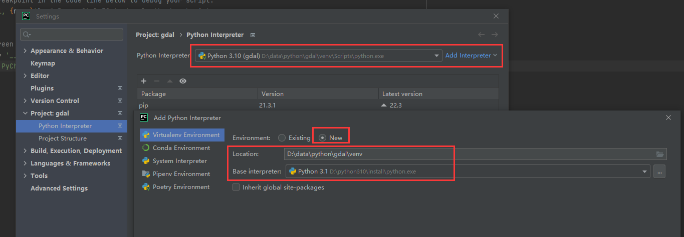
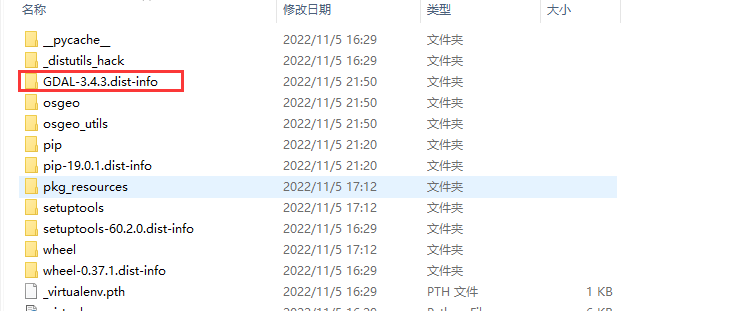
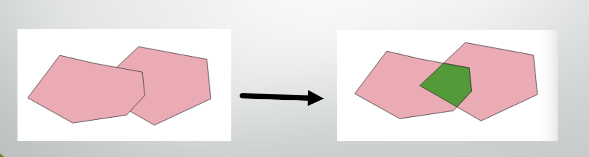
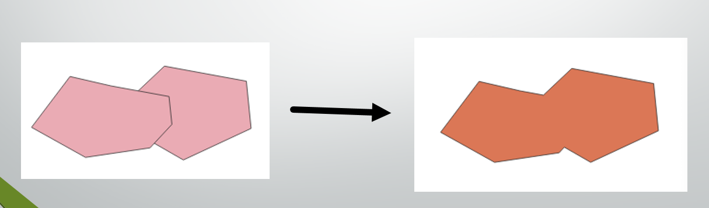
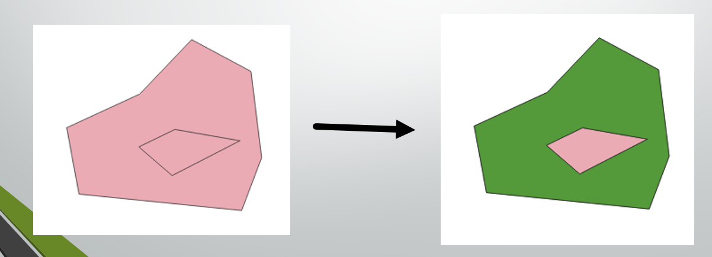
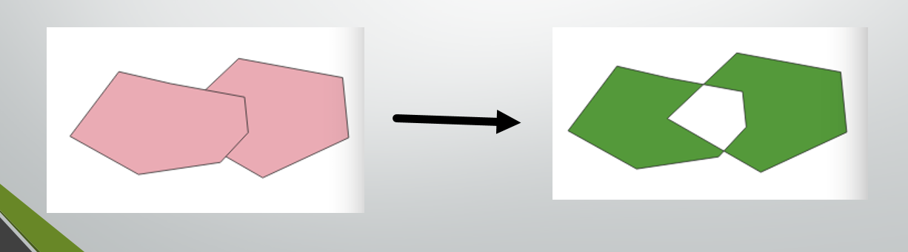

# Osgeo(Gdal3.4.3)

> osgeo: gdal + ogr
>
> 具体再需要确定什么去官网   https://gdal.org/






## 一、gdal

### 1.打开栅格数据集

- Rasterdataset = ‘geotiff.tif’

- Datasource = **gdal.Open**(RasterDataset)
  - rasterDataset:栅格数据所在路径及栅格数据名称
  
  ```python
  """
  设置栅格配置信息
  @DriverName：具体的驱动类型
  @source：栅格数据的路径
  """
  def setRasterConfig(DriverName, source):
      driver = gdal.GetDriverByName(DriverName)#设置驱动
      dataSource = gdal.Open(source)
      return dataSource
  
  """
  读取栅格信息
  @RasterObject:已经得到的栅格数据集对象
  """
  def readRaster(RasterObject):
      xRowNum = RasterObject.RasterXSize
      print("栅格数据x方向的像素数" , xRowNum , "return索引值为0")
      yRowNum = RasterObject.RasterYSize
      print("栅格数据y方向的像素数" , yRowNum , "return索引值为1")
      bandCountNum = RasterObject.RasterCount
      print("栅格数据的波段数（块）" , bandCountNum , "return索引值为2")
      rasProjection = RasterObject.GetProjection()
      print("获取栅格数据的坐标信息" , rasProjection , "return索引值为3")
      rasSixList = RasterObject.GetGeoTransform()
      print("列表信息六参数" , rasSixList , "return索引值为4")
      band_arr = RasterObject.GetRasterBand(0).ReadAsArray()
      print("这里我们测试波段一，共有7个波段" , band_arr , "return索引值为5")
      sub_band = RasterObject.GetRasterBand(1).ReadAsArray(400, 600, 10, 10)
      print("第400列，600行，10 * 10格子" , sub_band , "return索引值为6")
      return xRowNum,yRowNum,bandCountNum,rasProjection,rasSixList,band_arr,sub_band
    
    
  if __name__ == "__main__":
      tifpath = 'D:/data/python/gdal/image/'
      outpath = tifpath + "/" + 'outPutImage/exampleOne'
      tifname = 'enter_union.tif'
      readResult = setRasterConfig('GTiff', tifpath + tifname)
      readRaster(readResult)
  ```

### 2.查看栅格数据集的信息

- Datasource.RasterXsize:栅格数据x方向的像素数

- Datasource.RasterYsize:栅格数据y方向的像素数

- Datasource.RasterCount:栅格数据的波段数（块）

- Datasource.**GetProjection**()：获取栅格数据的坐标信息

- Geoinfo **=** **datasource.**GetGeoTransform()   //得到六参数信息

  - 返回的Geoinfo是一个列表(list)

    - 0：原点的X坐标
    - 1：像素宽度，pixelwidth
    - 2：x像素旋转（0°，正北向）
    - 3.原点的Y坐标
    - 4.y像素旋转（0°，正北向）
    - 5.像素高度（负值）,pixelheight

  - 某一坐标对应像素的**相对位置（pixel,offset),即改坐标与左上角的相对位置

     xOffset = int(x-originX)/PixelWidth

     yOffset = int(y-originY)/PixelHeight

### 3.查看单波段信息

- Band = datasource.**GetRasterBand**(index):获取指定索引的波段

  - Band.Xsize：某波段的x方向的像素数
  - Band.Ysize:某波段的y方向的像素数
  - Band.GetNoDataValue:NoData的值
  - Band.GetMaximum()：最大值
  - Band.GetMinimum()：最小值
  - Band.GetMetadata()：元数据
  - Band.ComputeRasterMinMax()：最大最小值

- 读取波段某位置数值信息

  - **Band.ReadAsArray**([xoff],[yoff],[win_xsize],[win_ysize],[buf_xsize],[buf_ysize],[buf_obj])

    - Xoff:列的起点，默认为0
    - Yoff:行的起点，默认为0
    - Win_xsize:要读取得列数，默认读取所有列
    - Win_ysize:要读取得行数，默认读取所有行
    - Buf_xsize:输出数组的列数，默认等于win_xsize,不等于数据将会重采样
    - Buf_ysize:输出数组的行数，默认等于win_ysize,不等于数据将会重采样
    - Buf_obj:存放数组，不同于numpy数组

  - 读取某个像素：ReadRasterAsArray(xoff,yoff,1,1):读取1*1矩阵

    读取所有像素：ReadRasterAsArray(0,0,cols,rows)：读取cols*rows矩阵

### 4.创建一个栅格数据集

- **outRaster=Driver.Create**(filename,xsize,ysize,[bands],[data_type],[options])
  - Filename:创建的栅格数据集路径
  - Xsize：创建的栅格数据集的行数
  - Ysize:创建的栅格数据集的列数
  - Bands：创建的栅格数据集的波段数，默认为1
  - Data_type:存储在创建的栅格数据集中的数据类型，默认是GDT_Byte
  - Options:字符串列表，基于所创建的数据集的类型
- outRaster.SetProjection(prjinfo)  #设置地理坐标信息
- outRaster.SetGeoTransform(geoinfo)  #设置六参数信息
- outband = outRaster.GetRasterBand(**index**)
  - OutRaster:新建的单波段或多波段栅格数据集
  - Index:新建的单波段或多波段的波段索引号
- outband.WriteArray(bandArray)
  - bandArray:待写入的栅格数组，栅格数组写入outband
  - FlushCache():把缓存数据写入磁盘

```python
#!/usr/bin/env python
# _*_ coding:utf-8 _*_
__author__ = 'SmallTiger'

from osgeo import gdal

"""
设置栅格配置信息
@DriverName：具体的驱动类型
@source：栅格数据的路径
"""
def setRasterConfig(DriverName, source):
    driver = gdal.GetDriverByName(DriverName)#设置驱动
    dataSource = gdal.Open(source)
    return dataSource

"""
导出单个波段栅格影像
@RasterObject：数据集对象
@outPath：输出路径
"""
def exportSingleRaster(RasterObject,outPath):
    bandCount = RasterObject.RasterCount  #波段数
    for i in range(bandCount):
        band = RasterObject.GetRasterBand(i+1)#读取第一波段
        band_arr = band.ReadAsArray()#读取二维数组
        gtiffDriver = gdal.GetDriverByName('GTiff')
        outPutImage = gtiffDriver.Create(outPath + '/exmaple' + str(i+1) + 'Result.tif', \
                                         band.XSize, band.YSize, 1, band.DataType)#创建tif
        outPutImage.SetProjection(RasterObject.GetProjection())#设置坐标系
        outPutImage.SetGeoTransform(RasterObject.GetGeoTransform())#设置六参数
        outband = outPutImage.GetRasterBand(1)#创建第一波段
        outband.WriteArray(band_arr)#写入数组
        outPutImage.FlushCache()
        del outPutImage

if __name__ == "__main__":
    tifpath = 'E:/ArcpyGIS/seconeTerm/images'
    outpath = tifpath + "/" + 'outPutImage/exampleTwo'
    tifname = 'union1234567.tif'
    readResult = setRasterConfig('GTiff',tifpath + "/unionResult/" + tifname)
    exportSingleRaster(readResult,outpath)
```

### 5.矢量边界裁剪（掩膜提取）

- gdal.**Warp**(outTif,originRaster,format,cutlineDSName)
  - outTif:剪裁后的栅格数据
  - originRaster：待剪裁的栅格数据
  - Format:栅格数据类型
  - cutlineDSName:矢量边界

```python
#!/usr/bin/env python
# _*_ coding:utf-8 _*_
__author__ = 'SmallTiger'

from osgeo import gdal

"""
裁剪栅格
@outPut：输出裁剪结果影像的路径
@intPut：被裁减的原始影像
@Geoformat：栅格数据类型
@featureShp：矢量图层
"""
def ClipRaster(outPut, intPut, Geoformat, featureShp):
    source = gdal.Open(intPut)
    ClipProcess = gdal.Warp(outPut, \
                            source, \
                            format = Geoformat, \
                            cutlineDSName = featureShp, \
                            cropToCutline = True)#wrap是裁剪命令具体参数意思见前边
    ClipProcess.FlushCache()
    del ClipProcess

if __name__ == "__main__":
    tifpath = 'E:/ArcpyGIS/seconeTerm/images/outPutImage/exampleTwo/exmaple1Result.tif'
    outpath = 'E:/ArcpyGIS/seconeTerm/images/outPutImage/exampleFive/ClipResRaster.tif'
    ClipShp = 'E:/ArcpyGIS/seconeTerm/images/clip.shp'
    ClipRaster(outpath,tifpath,'GTiff',ClipShp)
```

### 6.坐标转换

- import osr：导入osr模块

- srs = osr.SpatialReference():创建一个空间参考对象

- srs.ImportFromEPSG(Index)：根据EPSG的索引编号获取空间坐标信息

- srs.ExportToWkt()：空间坐标信息导出为WKT格式

- Gdal.warp(outtif,intif,format,srcSRS,dstSRS)
  - Outtif:输出的数据
  - Intif:原始数据
  - Format:数据格式
  - srcSRS:原始数据空间坐标信息
  - dstSRS:输出数据空间坐标信息
  
  ```python
  #!/usr/bin/env python
  # _*_ coding:utf-8 _*_
  __author__ = 'SmallTiger'
  
  from osgeo import osr
  from osgeo import gdal
  
  #source 要被读取的数据源
  def returnSrcPro(source):
      dataSource = gdal.Open(source)#读取数据源
      dataSourcePro = dataSource.GetProjection()#读取做消息
      return dataSource,dataSourcePro
  
  #proNumber EPSG的索引编号，用来获取空间坐标信息
  def returnOutPrj(proNumber):
      resPro = osr.SpatialReference()#创建一个空间参考对象
      resPro.ImportFromEPSG(proNumber)#这是个CGCS2000
      cgcs2000 = resPro.ExportToWkt()#转wkt格式
      return cgcs2000
  
  """
  转换原始影像坐标系
  @outTif：输出的文件
  @oriDataSou：原始影像数据集
  @format：驱动类型
  @oriDataPro：原始影像坐标系
  @resPro：输出文件的坐标系
  """
  def transPro(outTif,oriDataSou,format,oriDataPro,resPro):
      gdal.Warp(outTif,oriDataSou,\
                format = format,\
                srcSRS = oriDataPro, \
                dstSRS = resPro)#裁剪
  
  if __name__ == "__main__":
      intif = 'E:/ArcpyGIS/seconeTerm/images/outPutImage/exampleEight/exmaple1Result.tif'
      outTif = 'E:/ArcpyGIS/seconeTerm/images/outPutImage/exampleEight/exmaple2Result.tif'
      dataOri = returnSrcPro(intif)
      resPrj = returnOutPrj(4527)
      transPro(outTif,dataOri[0],'GTiff',dataOri[1],resPrj)
  ```

### 7.波段运算（如NDVI）

- Ndvi =（NIR-R）/(NIR+R)
  - NIR:近红外波段
  - R：红光波段
- Landsat8波段：
  - 红光波段： band4 
  - 近红外波段：band5

```python
#!/usr/bin/env python
# _*_ coding:utf-8 _*_
__author__ = 'SmallTiger'

from osgeo import gdal

#source 原始影像数据源
def returnOri(source):
    dataSource = gdal.Open(source)#打开数据源
    band4Red = dataSource.GetRasterBand(4)#读取第四波段
    band5Nir = dataSource.GetRasterBand(5)#读取第五波段
    red4Array = band4Red.ReadAsArray()#读取数组
    nir5Array = band5Nir.ReadAsArray()#读取数组
    resArray = (nir5Array - red4Array)/(nir5Array + red4Array)#计算ndvi
    return band4Red,dataSource,resArray

"""
波段计算--ndvi
@format：驱动类型
@outTif：输出文件位置及文件名
@Xnumber：X方向像素数目
@Ynumber：Y方向像素数目
@bandNumber：生成影像的波段数目
@dataType：生成影像的数据类型
@Target：原始影像数据源，为了后面用它的坐标系
@BandArray：需要被写入生成影像中的二维数组
"""
def createOutTif(format,outTif,Xnumber,Ynumber,bandNumber,dataType,Target,BandArray):
    driver = gdal.GetDriverByName(format)
    out_tif = driver.Create(outTif,Xnumber,Ynumber,\
                            bandNumber,dataType)#创建影像
    out_tif.SetProjection(Target.GetProjection())#设置坐标系
    out_tif.SetGeoTransform(Target.GetGeoTransform())#设置六参数
    outBand = out_tif.GetRasterBand(1)#创建第一波段
    outBand.WriteArray(BandArray)#写入数组
    out_tif.FlushCache()
    del out_tif

if __name__ == "__main__":
    intif = 'E:/ArcpyGIS/seconeTerm/images/outPutImage/exampleNine/union1234567.tif'
    outTif = 'E:/ArcpyGIS/seconeTerm/images/outPutImage/exampleNine/exampleNine.tif'
    dataOri = returnOri(intif)
    createOutTif('GTiff',outTif,dataOri[0].XSize,dataOri[0].YSize,\
                 1,gdal.GDT_Float32,dataOri[1],dataOri[2])

```

### 8.等高线

- gdal.ContourGenerate(0，1，2，3，4，5，6，7，8，9,10)
  - 0：srtBand:dem波段
  - 1：ContourInterval:等高线间隔的单位距离
  - 2：ContourBase:等高线起始高度
  - 3：fixedLevelCount:等高线固定距离（像对于间隔距离）
  - 4：useNodata：是否使用nodata
  - 5：noDataValue:nodata的值
  - 6：dstLayer:输出等高线的矢量图层
  - 7：idField:shappefile中必须有的dbf文件字段名称，通常为ID
  - 8:elevField:shapefile中必须有的dbf字段名称，高程值
  - 9:Callback:回调函数
  - 10:Callback_data:回调函数值

```python
#!/usr/bin/env python
# _*_ coding:utf-8 _*_
__author__ = 'SmallTiger'

from osgeo import gdal
from osgeo import ogr

#source 待被读取的原始数据
def readOriTif(source):
    datasource = gdal.Open(source)
    return datasource

"""
生成等高线
@format：驱动类型
@outShp：输出文件的位置及文件名
@shpName：文件名，不包含后缀
@dataSource：原始数据的数据集
"""
def CreateConLine(format,outShp,shpName,dataSource):
    ogr_driver = ogr.GetDriverByName(format)
    ogr_ds = ogr_driver.CreateDataSource(outShp)#创建数据源
    ogr_lyr = ogr_ds.CreateLayer(shpName, geom_type=ogr.wkbLineString25D)#创建图层
    field_defn = ogr.FieldDefn("ID", ogr.OFTInteger)#创建属性字段
    ogr_lyr.CreateField(field_defn)
    field_defn = ogr.FieldDefn("ELEV", ogr.OFTReal)
    ogr_lyr.CreateField(field_defn)
    gdal.ContourGenerate(dataSource.GetRasterBand(1), 3000, 8100, [], 0, 0, ogr_lyr, 1, 0)#设置等高线的参数信息
    ogr_ds = None

if __name__ == "__main__":
    intif = 'E:/ArcpyGIS/seconeTerm/images/outPutImage/exampleTen/result.tif'
    shpName = 'contour_3000'
    outShp = 'E:/ArcpyGIS/seconeTerm/images/outPutImage/exampleTen/' + shpName + '.shp'
    dataOri = readOriTif(intif)
    CreateConLine('ESRI Shapefile',outShp,shpName,dataOri)
```

### 9.坡度/坡向/山体阴影

- gdal.DEMProcessing(outname,srcDS,processing,options)
- Outname:输出数据名称
  - srcDS:dem名称
- Processing:处理过程（”slope”,”aspect”,”hillshade”, "Roughness”…）
  - Option:选择项: format = “GTiff”


```python
#!/usr/bin/env python
# _*_ coding:utf-8 _*_
__author__ = 'SmallTiger'

from osgeo import gdal

"""
坡度、坡向、山体阴影
@source：原始数据源
@ProcessType：具体处理方案，坡度/坡向/山体阴影
@outTif：输出文件位置及文件名
@format：数据类型
"""
def CreateSpeDemPro(source,ProcessType,outTif,format):
    dataSource = gdal.Open(source)#打开数据源
    if(ProcessType == 'slope'):
        gdal.DEMProcessing(outTif,dataSource,'slope',format = format)#坡度
    elif(ProcessType == 'aspect'):
        gdal.DEMProcessing(outTif, dataSource, 'aspect', format=format)#坡向
    else:
        gdal.DEMProcessing(outTif, dataSource, 'hillshade', format=format)#山体阴影

if __name__ == "__main__":
    iniTiff = 'E:/ArcpyGIS/seconeTerm/images/outPutImage/exampleEleven/result.tif'
    outNameArr = ['slope_1','aspect_1','hillshade_1']
    outTif = 'E:/ArcpyGIS/seconeTerm/images/outPutImage/exampleEleven/'
    CreateSpeDemPro(iniTiff,'slope',outTif + outNameArr[0] + '.tif','GTiff')
    CreateSpeDemPro(iniTiff, 'aspect', outTif + outNameArr[1] + '.tif', 'GTiff')
    CreateSpeDemPro(iniTiff, 'hillshade', outTif + outNameArr[2] + '.tif', 'GTiff')

```


## 二、ogr

### 1.driver

- Driver = **ogr.GetDriver****(index)**:按照索引设置某类数据的驱动**
- **Driver = **0gr.GetDriverByName（”name”）**:按照名称设置某类型数据的驱动**
  - **Num **=** **ogr.GetDriverCount****()**：返回支持的驱动数目**
  - **Driver.**Open**(datapath):打开矢量数据**
  - **Driver.**CreateDataSource**(outpath)：创建矢量数据

### 2.datasocurce

- Datasource = driver.Open(inshp)
  - GetName():获取矢量数据源（路径）
  - GetLayer():获取矢量数据的图层
  - CreateLayer():创建矢量数据图层
  - CopyLayer():复制矢量数据图层
  - DeleteLayer():删除矢量数据图层
  - GetLayerCount():获取矢量数据的图层数量
  - GetLayerByIndex():按照索引号获取矢量数据图层
  - GetLayerByName():按照名称获取矢量数据图层
  - FlushCache():清除缓存

### 3.layer

- **Layer** =datasource.GetLayer(index)
  - GetName():获取layer的名称 
  - CreateFeature()：在layer中创建一个新的feature
  - DeleteFeature():删除layer中的某index的feature
  - GetFeatureCount():获取layer中的feature数量
  - GetExtend():获取layer范围
  - FindFieldIndex(fieldname,True):查找field的索引号
  - CreateField(fielddefn):根据属性表字段属性创建字段
  - DeleteField(index):按照索引号删除字段

### 4.feature

- **Feature** = layer.GetFeature(index)
  - GetDefnRef():获取feature定义
  - GetGeometryRef():获取geometry(几何结构)
  - GetFieldCount():获取属性字段数量
  - GetFieldDefnRef():获取field定义
    - GetName():获取feature所在Layer名称
    - GetFieldCount():获取feature的字段数量
    - GetFieldIndex(fieldname):获取字段索引
    - GetFieldDefn():获取字段定义
      - GetName:获取字段名称
      - GetNameRef:获取字段名称
      - GetTypeName:获取字段内容类型
  - GetFieldIndex(fieldname):获取属性字段索引号
  - GetFID():获取feature的FID
  - ExportToJson()：输出为json

### 5.geometry

- **Geometry** = Feature.GetGeometryRef()
  - ExportToWkt:导出为wkt格式
  - ExportToJson:导出为JSON格式
  - GetGeometryName():获取几何名称
  - Lengh()：获取几何长度
  - Area():获取几何面积
  - GetPointCount():获取矢量点数量
  - GetPoints():获取几何点列表
  - GetPoint(index):获取某个点坐标
  - GetX(index):获取某个点的X坐标
  - GetY(index):获取某个点的Y坐标
  - GetZ(index):获取某个点的Z坐标

### 6.geometry的常用空间分析

1. Intersect  相交

   ```python
   """
   @source:原始shp文件
   @dataType:驱动类型
   """
   def test_intersect(dataType,source):
       driver = ogr.GetDriverByName(dataType)#驱动
       dataSource = driver.Open(source)#打开数据源
       lyr0 = dataSource.GetLayer(0)#第一个图层
       feat1 = lyr0.GetFeature(0)#第一个feature
       geom1 = feat1.GetGeometryRef()#几何结构
       feat2 = lyr0.GetFeature(1)#第二个feature
       geom2 = feat2.GetGeometryRef()#几何结构
       print(geom1.Intersect(geom2))#是否相交
       
   if __name__ == "__main__":
       inShp = 'E:/ArcpyGIS/seconeTerm/shapeFile/exampleNine/polygon.shp'
       test_intersect('ESRI Shapefile',inShp)
       test_withIn('ESRI Shapefile', inShp)
   ```

2. Contain  包含

3. Within  被包含

4. Centriod  中心点坐标

5. Distance  空间距离

6. Intersection  相交部分

   

7. Buffer  缓冲区

8. Union  联合

   

9. Difference  几何对象1去掉几何对象2的部分

   

10. SymDifference  交集取反

    

### 7.layer的常用空间分析

1. intersect

   ```python
   """
   @dataType:驱动类型
   @source1:原始shp文件1
   @source2:原始shp文件2
   @outPath:输出相交区域的shp文件
   """
   def layerIntersection(dataType,source1,source2,outPath):
       driver = ogr.GetDriverByName(dataType)#驱动
       ds1 = driver.Open(source1)  #数据源
       lyr1 = ds1.GetLayer(0)  #第一个图层
       ds2 = driver.Open(source2)
       lyr2 = ds2.GetLayer(0)
       newDataSource = driver.CreateDataSource(outPath)#创建数据源
       newLyr = newDataSource.CreateLayer("testpolygon",geom_type = ogr.wkbPolygon)#创建图层
       ogr.Layer.Intersection(lyr1,lyr2,newLyr)#相交图层内容
       newDataSource.Destroy()
       
   
   if __name__ == "__main__":
       inSihuShp = 'E:/ArcpyGIS/seconeTerm/shapeFile/exampleTen/polygon_sihu.shp'
       inJiaweiShp = 'E:/ArcpyGIS/seconeTerm/shapeFile/exampleTen/polygon_jiawei.shp'
       outPath = 'E:/ArcpyGIS/seconeTerm/shapeFile/exampleTen/'
       outNameArr = ['interSec.shp','union.shp','symDiff.shp']
       layerIntersection('ESRI Shapefile',inSihuShp,inJiaweiShp,outPath+outNameArr[0])
   ```

2. union

   ```python
   """
   @dataType:驱动类型
   @source1:原始shp文件1
   @source2:原始shp文件2
   @outPath:输出合并区域的shp文件
   """
   def layerUnion(dataType,source1,source2,outPath):
       driver = ogr.GetDriverByName(dataType)  #
       ds1 = driver.Open(source1)  #
       lyr1 = ds1.GetLayer(0)  #
       ds2 = driver.Open(source2)
       lyr2 = ds2.GetLayer(0)
       newDataSource = driver.CreateDataSource(outPath)
       newLyr = newDataSource.CreateLayer("testpolygon",geom_type = ogr.wkbPolygon)
       ogr.Layer.Union(lyr1,lyr2,newLyr)#合并图层内容
       newDataSource.Destroy()
       
       
   if __name__ == "__main__":
       inSihuShp = 'E:/ArcpyGIS/seconeTerm/shapeFile/exampleTen/polygon_sihu.shp'
       inJiaweiShp = 'E:/ArcpyGIS/seconeTerm/shapeFile/exampleTen/polygon_jiawei.shp'
       outPath = 'E:/ArcpyGIS/seconeTerm/shapeFile/exampleTen/'
       outNameArr = ['interSec.shp','union.shp','symDiff.shp']
       layerUnion('ESRI Shapefile', inSihuShp, inJiaweiShp, outPath + outNameArr[1])
   ```

3. symdifference

   ```python
   """
   @dataType:驱动类型
   @source1:原始shp文件1
   @source2:原始shp文件2
   @outPath:输出交集取反区域的shp文件
   """
   def layerSymdiff(dataType,source1,source2,outPath):
       driver = ogr.GetDriverByName(dataType)  #
       ds1 = driver.Open(source1)  #
       lyr1 = ds1.GetLayer(0)  #
       ds2 = driver.Open(source2)
       lyr2 = ds2.GetLayer(0)
       newDataSource = driver.CreateDataSource(outPath)
       newLyr = newDataSource.CreateLayer("testpolygon",geom_type = ogr.wkbPolygon)
       ogr.Layer.SymDifference(lyr1,lyr2,newLyr)#交集取反图层内容
       newDataSource.Destroy()
       
       
   if __name__ == "__main__":
       inSihuShp = 'E:/ArcpyGIS/seconeTerm/shapeFile/exampleTen/polygon_sihu.shp'
       inJiaweiShp = 'E:/ArcpyGIS/seconeTerm/shapeFile/exampleTen/polygon_jiawei.shp'
       outPath = 'E:/ArcpyGIS/seconeTerm/shapeFile/exampleTen/'
       outNameArr = ['interSec.shp','union.shp','symDiff.shp']
       layerSymdiff('ESRI Shapefile', inSihuShp, inJiaweiShp, outPath + outNameArr[2])
   ```

   

​	
