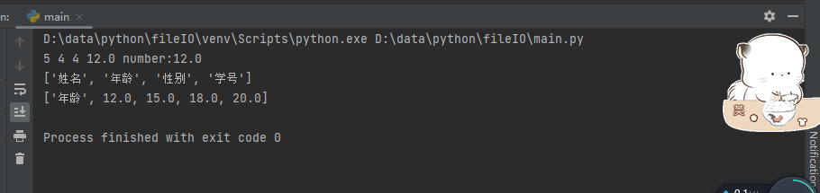
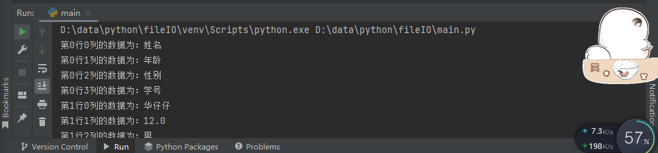
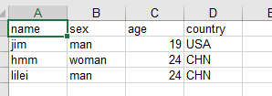
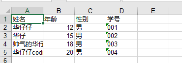
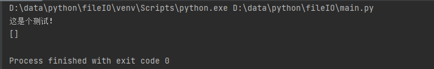
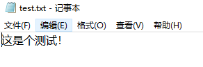

# ExcelTxt

## 一、Excel操作

### 1、xlrd 2.0.1

> 按需读取

```python
def read_xls(filename):
    # 打开文件路径
    data = xlrd.open_workbook(filename)
    # 获取表格
    sheet0 = data.sheets()[0]  # 通过索引获取
    # sheet1 = data.sheet_by_name('Sheet1')  # 通过sheet名称获取
    # print(sheet0.name, sheet1)
    # 行列操作
    rows = sheet0.nrows  # 获取表格的行数
    cols = sheet0.ncols  # 获取表格的列数
    num = sheet0.row_len(0)  # 获取某行的有效单元格长度
    rowlist = sheet0.row_values(0, 0)  # 获取第一行从第一列到最后一列的所有数据
    collist = sheet0.col_values(1, 0)  # 获取第二列从第一行到最后一行的所有数据
    testValue = sheet0.cell_value(1, 1)  # 获取指定单元格内的值
    typeValue = sheet0.cell(1, 1)  # 获取对应单元格的类型及值
    print(rows, cols, num, testValue, typeValue)
    print(rowlist)
    print(collist)

if __name__ == '__main__':
    path = r'D:\data\python\fileIO\成绩表22.xls'
    read_xls(path)
```



> 全部读取

```python
def printall(filename):
    data = xlrd.open_workbook(filename)
    sheet = data.sheets()[0]
    nrows = sheet.nrows
    ncols = sheet.ncols
    for row in range(nrows):
        for col in range(ncols):
            value = sheet.cell_value(row, col)
            print('第{}行{}列的数据为：{}'.format(row, col, value))
            
if __name__ == '__main__':
    path = r'D:\data\python\fileIO\成绩表22.xls'
    printall(path)
```




### 2、xlwt 1.3.0

> 简单写入

```python
def writexls(filename):
    value = [["name", "jim", "hmm", "lilei"], ["sex", "man", "woman", "man"], ["age", 19, 24, 24], ["country", "USA", "CHN", "CHN"]]
    xls = xlwt.Workbook('utf-8')  # 确定编码格式
    sheet = xls.add_sheet('这是Sheet2', False)  # 确定表格名称
    # sheet = xls.add_sheet('这是Sheet2', True)  # 注意python中的布尔值用大写,True表示能否覆盖
    for i in range(0, 4):
        for j in range(0, len(value)):
            sheet.write(j, i, value[i][j])   # write写入位置j是行，i是列
    xls.save(filename)
    
if __name__ == '__main__':
    path = r'D:\data\python\fileIO\成绩表22.xls'
    writexls(path)
```



> 写入字典数据

```python
def writeenum(filename, dataone):
    my_workbook = xlwt.Workbook()
    sheet = my_workbook.add_sheet('test_sheet')
    name_list = ['姓名', '年龄', '性别', '学号']
    for i in name_list:
        sheet.write(0, name_list.index(i), i)  # 其中name_list.index(i)返回对应每个要素的索引，从0开始
    for i, item in enumerate(dataone):    # 其中i是当前列表中每个字典元素的下表，item是是当前字典的值，通过item['键']，即可得到对应的键值
        sheet.write(i + 1, 0, item['name'])
        sheet.write(i + 1, 1, item['age'])
        sheet.write(i + 1, 2, item['gender'])
        sheet.write(i + 1, 3, item['xuehao'])
    my_workbook.save(filename)
    
if __name__ == '__main__':
    path = r'D:\data\python\fileIO\成绩表22.xls'
    data = [
        {
            'name': '华仔仔',
            'age': 12,
            'gender': '男',
            'xuehao': '001'
        },
        {
            'name': '华仔',
            'age': 15,
            'gender': '男',
            'xuehao': '002'
        },
        {
            'name': '帅气的华仔仔',
            'age': 18,
            'gender': '男',
            'xuehao': '003'
        },
        {
            'name': '华仔仔coding',
            'age': 20,
            'gender': '男',
            'xuehao': '004'
        }
    ]
    writeenum(path, data)
```




## 二、Txt操作

> 读取txt

```python
def readTxt(filename):
    file = open(filename, 'r', encoding='UTF-8')
    firsttxt = file.readline()  # 读取第一行
    print(firsttxt)
    allTxt = file.readlines()   # 读取所有行
    print(allTxt)
    for line in allTxt:
        removewraptxt = line.strip('\n')  # 去除列表中每一个元素的换行符
        print(removewraptxt)
    file.close()   # 记得每次读取结束将文件关闭

if __name__ == '__main__':
    txtPath = r'D:\data\python\fileIO\test.txt'
    readTxt(txtPath)
    writetxt(txtPath)
```



> 写入txt

```python
def writetxt(filename):
    file = open(filename, 'w', encoding='UTF-8')
    file.write("这是个测试！")
    file.close()

if __name__ == '__main__':
    txtPath = r'D:\data\python\fileIO\test.txt'
    readTxt(txtPath)
    writetxt(txtPath)
```

