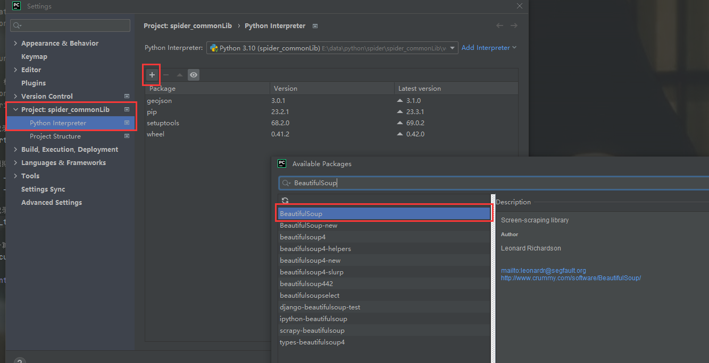
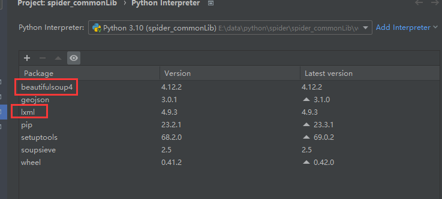
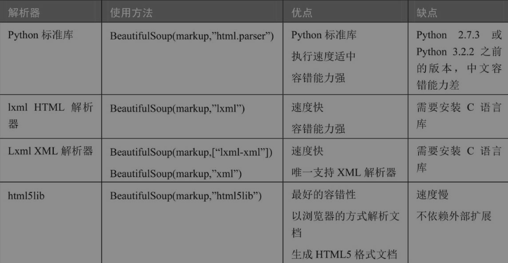
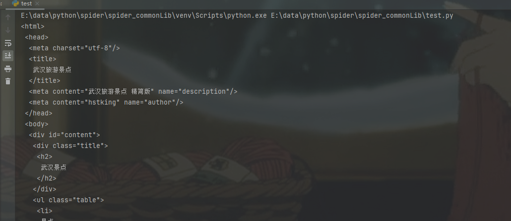
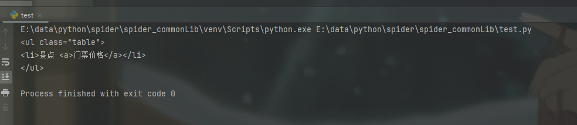
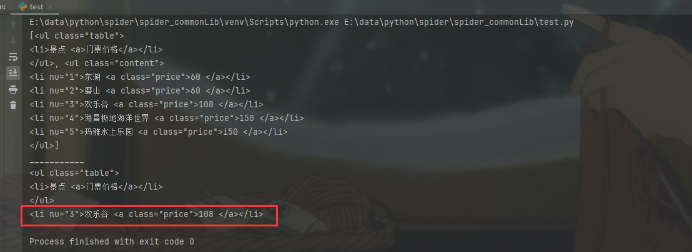
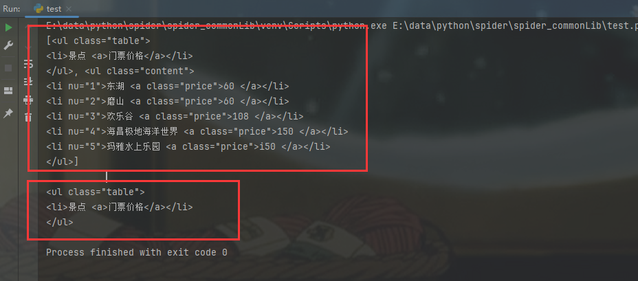

# BeautifulSoup

## 一、安装BeautifulSoup环境

:bulb: bs4 是一个第三方那个模块，通过pip安装

pycharm中 setting > Project XXX > Python Interpreter > 通过 + 可下载对应的依赖包




## 二、BeautifulSoup解析器

### 2.1 解析器的安装

- Bs4比Scrapy多了一个解析的过程，因此需要一个解析器
  - 同样通过pip安装即可



- 网络爬虫的最终目的是过滤选择网络信息，`解析器的忧虑决定了爬虫的速度 和 效率`。Bs4库支持的解析器有如下




### 2.2 使用案例

#### 查找方式

> :bulb: Bs4支持嵌套过滤，此外`支持通过标签名 和 标签属性查找`，注意用不同的find、find_all和for语句等组合方法查找需要的指定内容

**scenery.html文件**

```html
      <html>
      <head>
          <meta charset="utf-8">
              <title>武汉旅游景点</title>
          <meta name="description" content="武汉旅游景点 精简版" />
          <meta name="author" content="hstking">
      </head>
      <body>
      <div id="content">
             <div class="title">
                 <h2>武汉景点 </h2>
             </div>
             <ul class="table">
                 <li>景点 <a>门票价格</a></li>
             </ul>
             <ul class="content">
                 <li nu="1">东湖 <a class="price">60 </a></li>
                 <li nu="2">磨山 <a class="price">60 </a></li>
                 <li nu="3">欢乐谷 <a class="price">108 </a></li>
                 <li nu="4">海昌极地海洋世界 <a class="price">150 </a></li>
                 <li nu="5">玛雅水上乐园 <a class="price">i50 </a></li>
             </ul>
         </div>
     </body>
     </html>
```

:bulb: Bs4中pritter()方法用于将 HTML 或 XML 结构化数据进行格式化，使其更易于阅读和理解。例如增加缩进和换行，使其呈现出良好的层次结构


**test.py**

```python
# -*- coding: utf-8 -*-

from bs4 import BeautifulSoup

soup = BeautifulSoup(open('scenery.html', encoding='utf-8'), 'lxml')
print(soup.prettify())

```



:bulb: `BeautifulSoup(response.read(), ...)` 和 `BeautifulSoup(open(), ...)` 这两种方法有以下区别：

1. **`BeautifulSoup(response.read(), ...)`**：
   - 这种方法通常用于处理从网络请求（例如使用 `urllib` 或 `requests` 库获取的数据）返回的 HTML 内容。
   - `response.read()` 会读取 HTTP 响应的内容（即 HTML 数据），然后将其传递给 `BeautifulSoup` 对象，用于解析和处理 HTML。
2. **`BeautifulSoup(open(), ...)`**：
   - 这种方法通常用于处理本地文件中的 HTML 或 XML 内容。
   - `open()` 函数用于打开本地文件，读取其中的内容，并将内容传递给 `BeautifulSoup` 对象。


> 通过BeautifulSoup类的方法如read或者 open得到bs4对象后，`bs4会将网页节点解析成一个个标签（Tag），同名的标签也会不同的属性，此外他们也有先后顺序 和 不同的父子标签，所以这些每个Tag都有自己的独特位置`。


#### find()

如下可通过soup.ul 或者 soup.find('ul')方法可以查找对应soup对象中的ul标签

```python
from bs4 import BeautifulSoup

soup = BeautifulSoup(open('scenery.html', encoding='utf-8'), 'lxml')
soup.prettify()

print(soup.find_all('ul'))
```



:bulb: find()方法 和 直接soup.ul两者间的区别

1. **`soup.ul`**：
   - 这种方式是通过属性访问直接获取 Beautiful Soup 对象中的第一个 `<ul>` 标签。
   - 如果存在多个 `<ul>` 标签，这种方法只能获得第一个 `<ul>` 标签，不能获取其他的。
2. **`soup.find('ul')`**：
   - 这是 `find()` 方法的使用，用于显式地查找匹配的标签。
   - 它能够查找文档中符合条件的所有 `<ul>` 标签，而不仅仅是第一个。

> 但两者最终都只会返回一个标签结果，如需要多个标签结果，可使用find_all()


此外find方法还可添加属性名 和 属性值 进而更加精确地定位到某个标签。如soup.find(TagName, attrs = {attrName: attrValue})，soup.find('li', attrs={'nu': '3'})、soup.find_all('a', attrs={'class':'price'})     

```python
print(soup.find('li', attrs={'nu': '3'}))
```




#### find_all()

该方法可以获取到所有相同标签名相同的标签节点，并通过列表的形式获取到其中任意索引位置的标签。如soup.find_all('ul')[0]

```python
# -*- coding: utf-8 -*-

from bs4 import BeautifulSoup

soup = BeautifulSoup(open('scenery.html', encoding='utf-8'), 'lxml')
soup.prettify()

print(soup.find_all('ul'))
print('___________')
print(soup.find_all('ul')[0])

```




#### get() & get_text()

通过soup.find().get 或者 soup.find().get_text()方法可以获取到标签内的属性值 和 文本内容。

