# 爬虫常用模块

## 一、Python爬虫技术核心

### 1.1 实现原理

第一步：使用Python的网络模块，比如urllib2、httplib、requests等模块，模拟浏览器向服务器发送正常的http（https）请求。服务器正常响应后，主机将收到包含所需信息的网页代码。

为了使Python发送的http（https）请求更像是浏览器发送的，可以在其中`添加header和cookies`。为了欺骗服务器的反爬虫，可以采取`利用代理或间隔一段时间`发送一个请求，以尽可能地避开反爬虫。


第二步：主机使用过滤模块，比如lxml、html.parser、re等模块，将所需信息从网页代码中过滤出来。

一个或多个模块用于过滤得到有效信息，常使用`re`模块。


### 1.2 爬取策略

从爬虫程序出发，开始爬向多个页面，然后从页面中获取数据。这种形式有点类似于树状结构，如下图所示

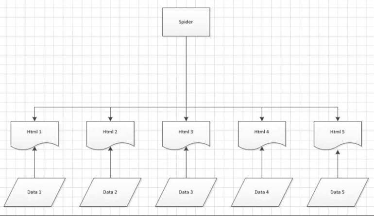

爬行顺序的选择有点类似于二叉树，一个是深度优先，一个是广度优先

- 深度优先
  - 先请求Html1的数据，再从得到的数据中过滤得到Data1。然后请求Html2的数据，再过滤得到Data2，如BeautifulSoup
- 广度优先
  - 先将所有的网页数据收集完毕，然后一一过滤获取有效数据，如Pyspider


### 1.3 身份破解

有些网站需要登录后才能访问某个页面，可以利用urllib2库保存登录的Cookie或其他登录信息，再抓取其他页面就可以了。如cookielib。


## 二、urllib.request

### 2.1 request请求示例

```python
import time
import urllib.request

def linkBaidu():
    url = 'http://www.baidu.com'
    try:
        response = urllib.request.urlopen(url, timeout=3)
        result = response.read().decode('utf-8')
    except Exception as e:
        print("网络地址错误")
        exit()
    with open('baidu.txt', 'w') as fp:
        fp.write(result)
    print("response.geturl(): %s" %response.geturl())

# Press the green button in the gutter to run the script.
if __name__ == '__main__':
    linkBaidu()


```

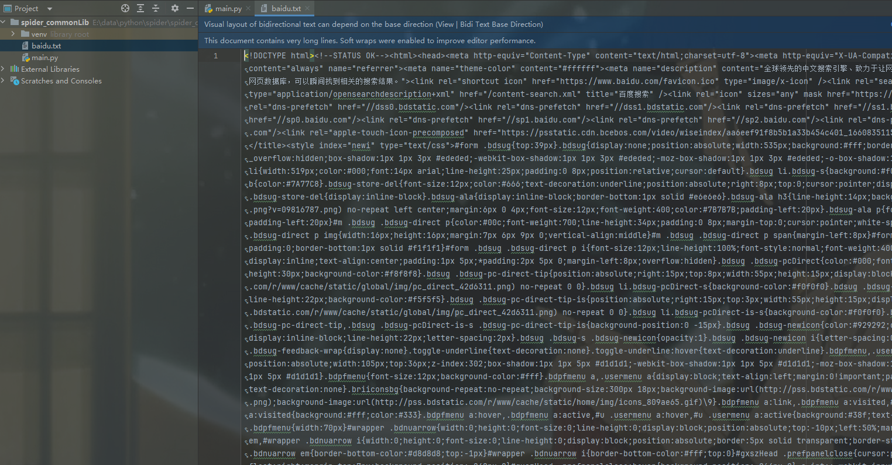

:warning: 当做了解，`urllib较为简单，尽量不用`，尽量使用如BeautifulSoup等的框架


## 三、logging

logging模块，用于日志保存。`logging模块可替代print函数功能，并将标准输出输入到日志文件保存`。


其他，暂略


## 四、re模块（正则）:star:

文件处理中不可少的模块，用于字符串的查找、定位。

### 4.1 字符

- .：匹配任意除换行符\n外的字符
- .abc匹配abc。\：转义字符，使后一个字符改变原来的意思，a\.bc匹配a.bc。
- […]：字符集（字符类）。对应字符集中的任意字符，第一个字符是^则取反。a[bc]d匹配abd和acd。


### 4.2 预定义字符集

- \d：数字[0-9]。
- \D：非数字`[^\d]`。
- \s：空白字符[空格\t\r\n\f\v]。
  - \t  制表符 Tab
  - \r  回车符 Carriage return
  - \n  换行符 Line Feed
  - \f  换页符  Form Feed
  - \v  垂直制表符 Vertical Tab

- \S：非空白字符`[^\s]`。

- \w：单词字符[a-zA-Z0-9_]。
- \W：非单词字符`[^\w]`。


### 4.3 数量词

- *：匹配前一个字符0或无限次。*a1*b匹配ab、a1b、a11b……
- +：匹配前一个字符1或无限次。a1*b匹配a1b、a11b……*
- *?：匹配前一个字符0或1次。a1*b匹配ab、a1b。
- {m}：匹配前一个字符m次。a1{3}b匹配a111b。
- {m,n}：匹配前一个字符m至n次。a1{2,3}b匹配a11b、a111b。


### 4.4 边界匹配

- ^：匹配字符串开头，如^abc匹配以abc开头的字符串。$
- $： 匹配以xyz结尾的字符串。
- \A：仅匹配字符串开头，如\Aabc。
- \Z：仅匹配字符串结尾，如Xyz\Z。

:bulb: 补充`^` 和 `$` 与 \A` 和 `\Z 之间的区别

```python
# `^` 和 `$`  会匹配所有行中的内容
#\A` 和 `\Z  会匹配整个字符串的开头和结尾
# -*- coding: utf-8 -*-

import re

# 默认模式下的 ^ 和 $
pattern1 = re.compile(r'^\d+', re.MULTILINE)  # 在多行模式下匹配每一行的开头
pattern2 = re.compile(r'\d+$', re.MULTILINE)  # 在多行模式下匹配每一行的结尾

text = """123
4ab
4as56
c78d89"""

result1 = pattern1.findall(text)
result2 = pattern2.findall(text)

print("Result using ^ (match start of lines):", result1)  # 匹配每一行的开头
print("Result using $ (match end of lines):", result2)  # 匹配每一行的结尾

# 使用 \A 和 \Z
pattern3 = re.compile(r'\A\d+', re.MULTILINE)  # 不受多行模式影响，匹配整个字符串的开头
pattern4 = re.compile(r'\d+\Z', re.MULTILINE)  # 不受多行模式影响，匹配整个字符串的结尾

result3 = pattern3.findall(text)
result4 = pattern4.findall(text)

print("Result using \\A (match start of string):", result3)  # 匹配整个字符串的开头
print("Result using \\Z (match end of string):", result4)  # 匹配整个字符串的结尾

```

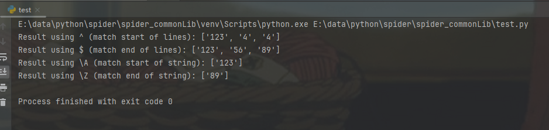

### 4.5 常用方法

compile()

- **说明**：编译正则表达式模式，返回一个正则表达式对象。
- **示例**：

```python
import re

pattern = re.compile(r'\d+')  # 编译一个匹配一个或多个数字的模式
print(pattern)
```

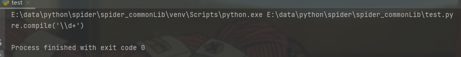


search()

- **说明**：在`字符串中搜索匹配正则表达式模式的第一个位置`，返回一个匹配对象或 None。
- **示例**

```python
result = re.search(r'\d+', 'The price is $50')  # 在字符串中搜索一个或多个数字
if result:
    print("Match found:", result.group())  # 输出匹配结果
else:
    print("No match")

```

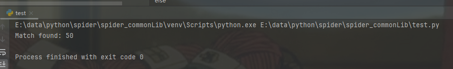


match()

- **说明**：尝试从字符串的`开头`匹配正则表达式模式，返回一个匹配对象或 None。
- **示例**：

```python
result = re.match(r'\d+', '123abc456')  # 尝试从字符串开头匹配一个或多个数字
if result:
    print("Match found:", result.group())  # 输出匹配结果
else:
    print("No match")

```

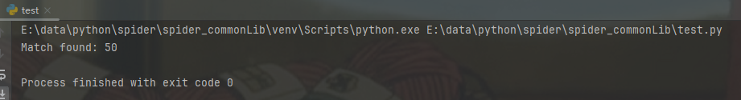

:bulb: 上述的match的group方法：当使用 `re.match()` 或 `re.search()` 进行匹配后返回的匹配对象（比如 `result_match` 或 `result_search`）中，`group()` 方法用于提取匹配到的文本内容。


findall()

- **说明**：返回字符串中所有与正则表达式模式匹配的字符串列表。
- **示例**：

```python
results = re.findall(r'\d+', 'There are 3 apples and 5 oranges')  # 找到所有的数字
print("Matches found:", results)  # 输出所有匹配结果

```

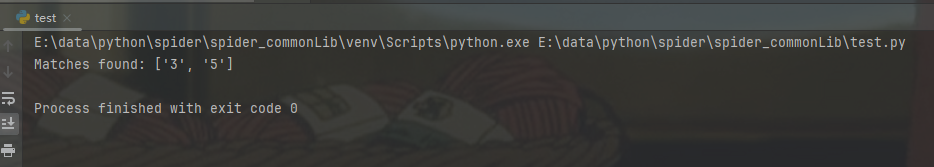


finditer()

- **说明**：返回一个迭代器，迭代器中每个元素是一个匹配对象，包含了正则表达式模式的匹配信息。
- **示例**：

```python
matches = re.finditer(r'\d+', 'There are 3 apples and 5 oranges')  # 找到所有的数字
for match in matches:
    print("Match found:", match.group())  # 输出每个匹配结果

```

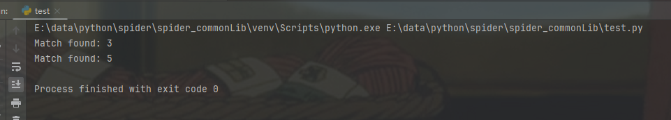


### 4.6 练习

**匹配邮箱地址**

```python
import re

pattern = r'^[a-zA-Z0-9._%+-]+@[a-zA-Z0-9.-]+\.[a-zA-Z]{2,}$'

emails = [
    "example@example.com",
    "john.doe@example.co.uk",
    "invalid_email.com",
    "another@example."
]

for email in emails:
    if re.match(pattern, email):
        print(f"{email} is a valid email.")
    else:
        print(f"{email} is not a valid email.")

```

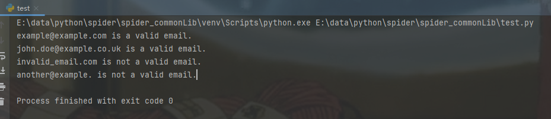

解释

- `^`：匹配字符串的开头。
- `[a-zA-Z0-9._%+-]+`：匹配邮箱地址的用户名部分。
  - []用于表示一个字符集，其中列出的字符可以匹配字符串中的任意一个字符。如`[abc]` 匹配单个字符，可以是 `a`、`b` 或 `c` 中的任意一个。
  - `._%+-` 匹配特殊字符 `.`, `_`, `%`, `+`, `-` 中的任意一个。
- `@`：匹配邮箱地址中的 @ 符号。
- `[a-zA-Z0-9.-]+`：匹配邮箱地址的域名部分。
- `\.`：匹配邮箱地址中的点号。
  - `\`表示转义符
- `[a-zA-Z]{2,}$`：匹配邮箱地址中的顶级域名部分。
  - {2, }$ 用于匹配至少2个字母的域名结尾部分


**匹配电话号码**

```python
import re

pattern = r'^\+\d{1,3}-\d{3,}-\d{6,}$'

phone_numbers = [
    "+1-123-456789",
    "+123-45-6789012",
    "123-456789",
    "+12-34567890"
]

for phone in phone_numbers:
    if re.match(pattern, phone):
        print(f"{phone} is a valid phone number.")
    else:
        print(f"{phone} is not a valid phone number.")

```

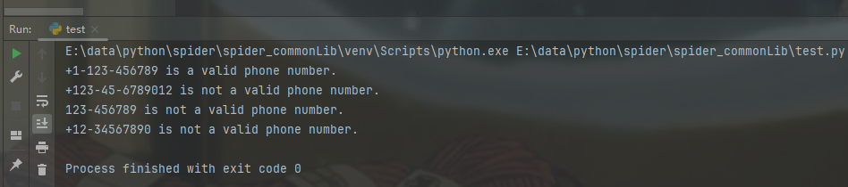

解释

- `^`：匹配字符串的开头。
- `\+`：匹配加号。
- `\d{1,3}`：匹配 1 到 3 位的数字，用于国家代码。
- `-`：匹配短横线。
- `\d{3,}`：匹配至少 3 位数字，电话号码的一部分。
- `-`：匹配短横线。
- `\d{6,}$`：匹配至少 6 位数字，电话号码的最后一部分。


**匹配HTML标签**

```python
import re

pattern = r'<h1>.*?</h1>'

html_content = """
<h1>This is a heading</h1>
<p>This is a paragraph.</p>
<h1>This is another heading</h1>
"""

headings = re.findall(pattern, html_content)

for heading in headings:
    print(f"Found heading: {heading}")

```

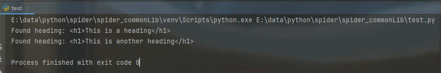

解释

- `<h1>`：匹配 `<h1>` 标签的开头部分。
- `.*?`：匹配任意字符（除换行符外）任意次，使用非贪婪匹配。
- `</h1>`：匹配 `</h1>` 标签的结尾部分。


## 五、其他模块

### 5.1 time

与时间相关的模块，常用方法如下

- time()

  - 返回当前的时间戳

- localtime()

  - 将当前时间戳转换成当前时区的struct_time

- sleep()

  - 计时器

- strftime()

  - 用于把一个srtuct_time转换成格式化的时间字符串，时间字符串支持的格式符号如下

  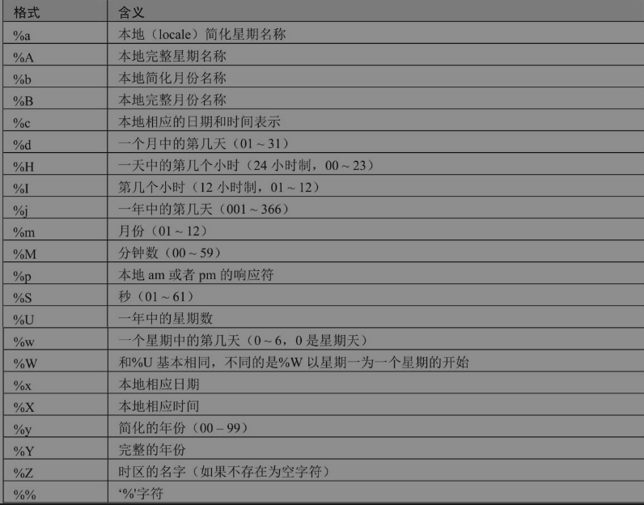

案例1

```python
import time

current_time = time.localtime()

# 格式化时间元组为字符串
formatted_time = time.strftime("%Y-%m-%d %H:%M:%S", current_time)
print("Formatted time:", formatted_time)

```

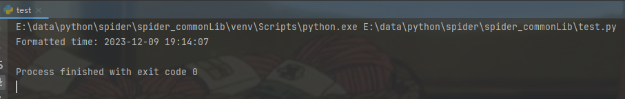


案例2

```python
# 记录开始时间
start_time = time.time()

# 模拟一个需要测量执行时间的代码块
for _ in range(1000000):
    _ = 2 * 2  # 这里可以放需要计时的代码

# 记录结束时间
end_time = time.time()

# 计算执行时间
execution_time = end_time - start_time

print(f"Execution time: {execution_time:.6f} seconds")
```

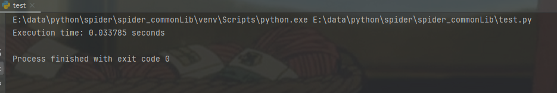