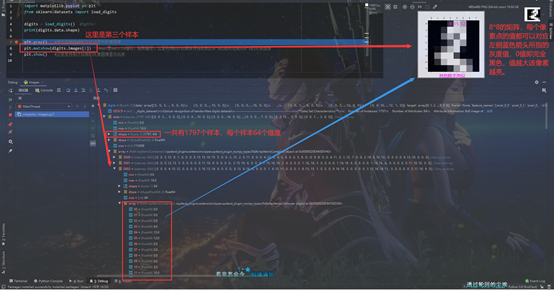
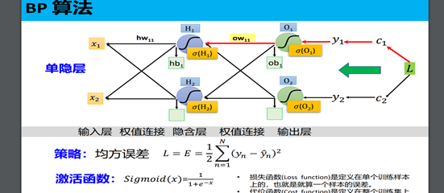
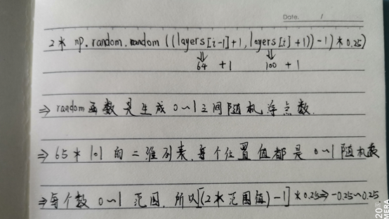
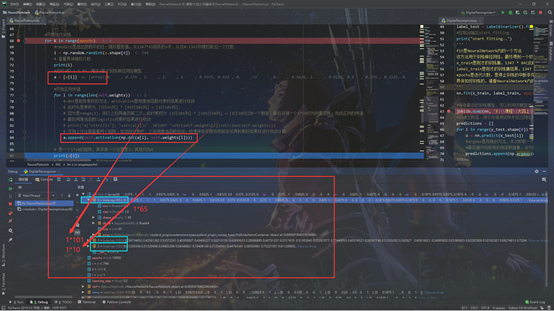
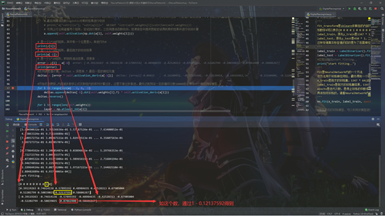
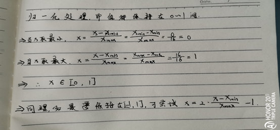
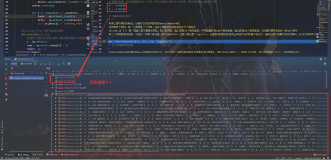
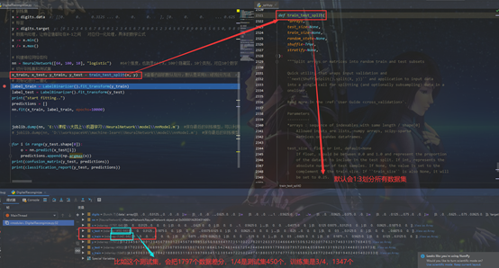

# sklearn

## 1、测试images.py

```python
import matplotlib.pyplot as plt
from sklearn.datasets import load_digits

digits = load_digits()
print(digits.data.shape)

plt.gray()   #用于将颜色映射方式设置为灰度图像
plt.matshow(digits.images[2])   #mat是matrix缩写，矩阵意思。这里利用plt依赖库将读取到的8*8的矩阵绘制成8*8的灰度图像
plt.show()   #这里是将刚才绘制的灰度图像显示出来

```

## 2、NeuralNetwork.py

```python
#引入依赖包
import numpy as np
#定义激活函数这些基本方法
def tanh(x):
    return np.tanh(x)

def tanh_deriv(x):
    return 1.0 - np.tanh(x) * np.tanh(x)

def logistic(x):
    return 1 / (1 + np.exp(-x))

def logistic_deriv(x):
    return logistic(x) * (1 - logistic(x))
#创建NeuralNetwork类别
class NeuralNetwork:
    #初始化
    def __init__(self, layers, activation="tanh"):
        #确定具体激活函数
        if activation == "logistic":
            self.activation = logistic
            self.activation_deriv = logistic_deriv
        elif activation == "tanh":
            self.activation = tanh
            self.activation_deriv = tanh_deriv
        #创建weights列表，用于存储权重值，即存储相邻神经网络层间的权重连接值，即理解为如课堂上讲的hw11等
        self.weights = []
        #这四个print用于个人理解代码时候测试使用
        print(len(layers))   #3，也就是三个层，输入、隐藏和输出三层神经
        print(layers[0] + 1)   #65，表示输入层，64个神经维度 + 1 = 65个维度，即1个有65维度的列向量
        print(layers[1] + 1)   #101，表示隐藏层，100个神经维度 + 1 = 101维度，即1个有101维度的列向量
        print(np.random.random((layers[0] + 1, layers[1] + 1)))   #生成一个65行 101列的浮点型列表，每个浮点数都在0-1之间
        '''
        这里range(1,2)，即只遍历l=1这一次
        np.random.random((layers[i - 1] + 1, layers[i] + 1))，返回一个65行 101列的浮点型列表，每个浮点数都在0-1之间，具体的计算见下图
        权重weights列表加入该65*101的二维列表
        后面的公式类似，weights再加入一个101 * 10 的二维列表，值的范围相同
        这两个二维列表可以理解为课堂上讲的输入层与隐藏层间的连接、隐藏层与输出层间的连接
        '''
        for i in range(1, len(layers) - 1):
            #间接理解为建立层之间的连接，层之间的神经元连接权重是范围-0.25 ~ 0.25
            self.weights.append((2 * np.random.random((layers[i - 1] + 1, layers[i] + 1)) - 1) * 0.25)  #生成一个65行 101列的二维矩阵
            self.weights.append((2 * np.random.random((layers[i] + 1, layers[i + 1])) - 1) * 0.25)  #生成一个101行 10列的二维矩阵

    #定义fit方法，用于训练神经网络
    def fit(self, x, y, learning_rate=0.2, epochs=10000):
        '''
        :param x:对应传过来的1347 * 64，内部值均已经归一化0-1
        :param y:对应1347 * 10，已经二值化后的结果
        :param learning_rate:学习率
        :param epochs:迭代次数，也是终止条件
        '''
        # atleast_2d，该方法将输入值改为二维数组，至少是二维矩阵
        x = np.atleast_2d(x)
        # 返回一个具有指定形状和数据类型的新数组，并且数组值均为1，默认数据类型是float64，同时可以设置其他，如int8
        temp = np.ones([x.shape[0], x.shape[1] + 1])
        '''
        此时temp是1347 * 65的二维矩阵，每个位置值均为1.0
        [:, 0:-1] = x，即所有行，所有行的前64列重新赋值为初始的已经归一化好的1347 * 64的二维列表的值，同时最后一列的1保持不变，即课堂上提到的偏置
        y是将1347 * 10的二维列表改为矩阵
        最后更新x、y结果，看如下图示
        '''
        temp[:, 0:-1] = x
        x = temp
        y = np.array(y)

        #开始迭代训练
        for k in range(epochs):
            #randint是选出参数中的任一随机整数值，从1347*65矩阵的x中，从该0-1347中随机取出一个行数
            i = np.random.randint(x.shape[0])
            # 查看具体随机行数
            print(i)
            #此时a即 1 * 65，用该a首次训练神经网络模型
            a = [x[i]]

            #开始正向传递
            for l in range(len(self.weights)):
                # dot是矩阵乘积的方法，activation是用激活函数对乘积结果进行收敛
                # 此时先是乘积为 [1行65列] * [65行101列] = [1行101列]，
                # 因为是range(2)，所以之后再遍历第二次，此时乘积为 [1行101列] * [101行10列] = [1行10列]加一个数组，最后存储一个1*10的列向量矩阵，完成正向的传递
                # 最后用激活函数logistic对乘积结果进行收敛
                # print("a["+str(l)+"]; "+str(a[l])+"  WEIGHT "+str(self.weights[l])+str(len(self.weights)))
                # 可用上行注释查看两个矩阵，尝试自行乘积，之后用激活函数收敛。结课报告中提供思路尝试得到乘积结果并进行收敛计算
                a.append(self.activation(np.dot(a[l], self.weights[l])))

            # 是一个1*10的矩阵，其中有一个位置是1，其他均为0
            print(y[i])
            # 是一个1*10的矩阵，最后刚才的收敛结果
            print(a[-1])
            # 是一个1*10矩阵，即矩阵减法结果，误差率
            error = y[i] - a[-1]
            print(error)
            #反向误差值计算，deltas = 误差率 * 最后一层的神经元值
            deltas = [error * self.activation_deriv(a[-1])]

            #开始反向更新,内部诸多数学公式及数组内的序列计算过多，这里不做过多赘述。最终达到预设一定的循环次数10000后会保存一个神经网络模型.
            for l in range(len(a) - 2, 0, -1):
                deltas.append(deltas[-1].dot(self.weights[l].T) * self.activation_deriv(a[l]))
            deltas.reverse()

            for i in range(len(self.weights)):
                layer = np.atleast_2d(a[i])
                delta = np.atleast_2d(deltas[i])
                self.weights[i] += learning_rate * layer.T.dot(delta)

    #定义predict方法，用于测试神经网络
    def predict(self, x):
        #这里同上面的fit初始x相同，最终目的得到1*65的矩阵，前边是x，最后加一个偏置1
        x = np.array(x)
        temp = np.ones(x.shape[0] + 1)
        temp[0:-1] = x
        a = temp
        # 这里先是[[1*65] * [65*101]] => [1*101] => [[1*101] * [101*10]] = > [1 * 10], 最后激活函数收敛，返回a
        # a是 1 * 10，内部10个数字会有值之间的大小关系，最后用argmax取最大值的索引位置值，即表示这个测试集x可能代表的标签值
        for l in range(0, len(self.weights)):
            a = self.activation(np.dot(a, self.weights[l]))
        return a

```

## 3、DigitalReconginize

```python
#引用依赖包
import joblib
from sklearn.preprocessing import LabelBinarizer
from NeuralNetwork import NeuralNetwork
from sklearn.model_selection import train_test_split
from sklearn.datasets import load_digits
import numpy as np
from sklearn.metrics import confusion_matrix, classification_report
import warnings

# 过滤警告标签，warming 是 python内置库，python中常遇到报错的情况，但不影响程序的运行，对于这些错误可以通过warming来去除这些警告错误
warnings.filterwarnings("ignore")

# 加载全部数据集
digits = load_digits()

# 所有训练集，内部包含1797个样本数据，每个数据是8*8的灰度图像，即64个维度，现在即1797 * 64
x = digits.data
# 所有真实值标签，即样本代表的实际真实数字值
y = digits.target
# 数据与处理，让特征值都处在0-1之间，即对应课堂上讲的归一化处理，具体的数学公式解释如下图
x -= x.min()
x /= x.max()

# 构建神经网络结构
'''
利用上面引用的依赖包，创建对应该包中提供的NeuralNetwork类
该类有两个参数，第一个参数是一个列表，包含了每层神经网络包含多少个神经元
64,100,10 》》 输入层有64个神经维度，中间隐藏层有100个神经维度，输出层有10个神经维度，对应最终要识别的0-9这10个数字
第二个参数是激活函数，可选项，如果不做设置，默认选择tanh。这里只是设置了logistic，设置激活函数目的是防止神经节点的数值不能过大，避免出现不能最终收敛的情况，也可以加快学习速度【注意logistic不是取对数】。
'''
nn = NeuralNetwork([64, 100, 10], "logistic")
# 切分训练集和测试集
'''
train_test_split是sklearn依赖包的内部方法，该方法可以将原始数据集将训练集和测试集差分，默认拆分比例是3:1，按照1797总数，所以训练集有1347个，测试集有450个
x_train是训练集的所有影像维度和，即1347 * 64；x_test是测试集所有影像维度和，即450 * 64；
y_train是训练集的所有真实标签和，即1347 * 1；y_test是测试集的所有真实标签和，即450 * 1；
'''
x_train, x_test, y_train, y_test = train_test_split(x, y)
# 对标记进行二值化
'''
fit_transform是sklearn依赖包的内部方法，该方法可以将某一具体数值进行二值化存储。
如数字4可以表示[0 0 0 0 1 0 0 0 0 0]；1可以表示为[0 1 0 0 0 0 0 0 0 0]
label_train，原先y_train是1347 * 1， 二值化后是1347 * 10
label_test，原先y_test是450 * 1，二值化后是450 * 10
这样存储真实标签值的目的是为了后面神经网络训练时候的误差检查及反向传递方便计算
'''
label_train = LabelBinarizer().fit_transform(y_train)
label_test = LabelBinarizer().fit_transform(y_test)
#控制台输出start fitting..
print("start fitting..")
'''
fit是NeuralNetwork内的一个方法
该方法用于训练神经网络，最终得到一个较好的训练模型
x_train是刚才的训练集，1347 * 64(此时已经归一化好了)
label_train是刚才的训练集结果，1347 * 10(二值化后的结果)
epochs是迭代次数，是停止训练的中断条件，即超过10000次就不训练了，即认为大致精度可以了
具体如何训练的，请看NeuralNetwork内的代码详解
'''
nn.fit(x_train, label_train, epochs=10000)

#保存最后的训练模型，可以利用该模型进行其他测试数据集的测试
#joblib.dump(nn, 'E:\\课程\\大四上\\机器学习\\nnModel.m')
#创建空数组，用于存储测试样本经过网络训练后得到的最终结果标签
predictions = []
for i in range(y_test.shape[0]):
    o = nn.predict(x_test[i])
    #argmax是降维的方法，本次即取一个行矩阵中最大位置的值的索引值，也就代表了该测试样本的预测标签
    #最后遍历完所有的测试数据集，会为每一个样本生成一个预测的预测标签，并依次添加到predictions中
    predictions.append(np.argmax(o))
'''
用测试数据集的预测标签和该样本的本身真实标签做对比
confusion_matrix是sklearn依赖包的内部方法，该方法最终会返回一个情形分析表，并以矩阵的方式存储真实类别和预测类别，具体详解见结果分析
classification_report是sklearn依赖包的内部方法，该方法会返回一个分析结果，具体详解见结果分析
'''
print(confusion_matrix(y_test, predictions))
print(classification_report(y_test, predictions))

```


- **相关截图**








​	          











